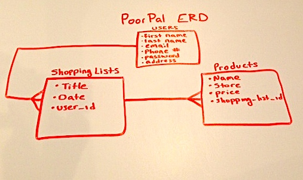

## PoorPal README

#### GA WDI NYC Jan 14, Project 1

##### An application that allows you to search for cheap products and organize them by the stores where they are cheapest!

* You can search for the cheapest product (i.e. Crest toothpaste) and get the store with the cheapest price
* You can create new Shopping Lists
* Items can be added to the shopping list as you receive the cheapest result
* Items will automatically be organized for you by store
* Shopping lists can be pushed to your phone via text messages

##### API's
* Semantics3
  A great API with over 2 billion products and prices that are continuosly updated!

* Twilio

#####Here is my ERD for the project

A list of this applications User Stories can be found [Here](https://www.pivotaltracker.com/s/projects/1015672)

Check out the application Here:
[PoorPal](http://poorpal.herokuapp.com/)

